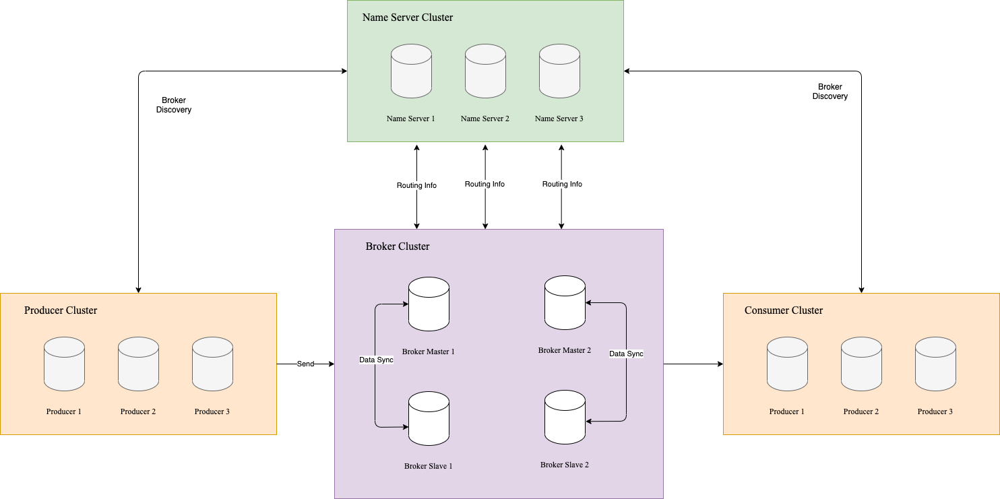

## name server 是什么

根据 RocketMQ 的技术架构图。name server 负责维护 broker 信息，对外提供接口供 producer 和 consumer 查询。

## name server 启动流程

name server 启动分为两步：构建 NamesrvController 实例和初始化 NamesrvController 实例。

- 构建 NamesrvController 实例
NamesrvController 主要由配置数据和 Netty 配置组成。配置可以通过命令行或者配置文件的方式进行指定，主要包括端口号配置、是否支持顺序消息、Netty 业务线程池线程数量、Netty 网络配置等。
- 初始化 NamesrvController 实例
根据配置启动 Netty 服务，启动两个定时任务（扫描 brokerLiveTable 和打印 kv 配置）、注册 JVM shutdown hook，实现服务的优雅关闭。

## name server 保存哪些数据

name server 负责维护 broker 的信息，那么 broker 是由哪些组件构成呢？

多个 broker 组成 broker cluster，broker 由多个 topic 组成，topic 又由多个 queue 组成。


要保存的数据包括：broker cluster 与 broker 映射关系，brokers 的基本属性，topic 与 queue 映射关系。

对应到源码：

```java
// broker cluster 与 broker 映射关系
private final HashMap<String*, Set<String*>> clusterAddrTable;
// 所有 broker 基本属性
private final HashMap<String, BrokerData> brokerAddrTable;
// topic 和 queue 的映射关系
private final HashMap<String, List<QueueData>> topicQueueTable;
// 存活的 broker 列表
private final HashMap<String, BrokerLiveInfo> brokerLiveTable;
```

**注意：数据不包括 topic 和 broker 的映射关系，因为在发送消息时，会根据轮询算法分配到具体的队列上，RocketMQ 通过在 QueueData 中保存 broker 信息来完成消息具体的投放。**

## name server 如何管理数据

name server 通过**心跳机制**维护数据。

具体来说，当 broker 启动后，每隔 30s 会向所有的 name server 发送当前 broker 的数据，包括集群信息、broker 基础信息和 topic 配置信息等。

name server 接收到数据后，会调用 `RouteInfoManager#registerBroker` 方法完成 broker 数据的注册，核心流程如下：


name server 在启动后会创建一个每 10s 运行一次的定时任务，每次运行会遍历 brokerLiveTable 列表，获取 broker 的上次更新时间，如果该时间 + 120s < 当前时间，代表该 broker 已经失联，将其从 brokerLiveTable 中剔除，并且会将与该 broker 相关联的 `clusterAddrTable`、`brokerAddrTable`、`topicQueueTable` 所有数据清除。

当 producer 或 consumer 向 name server 请求 topic 数据时，name server 通过`topicQueueTable` 获取 queue 信息，通过 queue 获取 broker 信息，通过 `brokerAddrTable` 和 `clusterAddrTable` 填充 broker 信息。将信息组合后返回给调用方，由调用方自己构建策略，完成调用逻辑。

## 总结

1. name server 负责存储 producer 和 consumer 所需的 broker 所有信息。
2. 信息包括 cluster → broker 映射、brokers 基础数据、topic → queue 映射、存活的 broker 列表。
3. name server 通过心跳机制完成 broker 信息的采集。
4. name server 通过内部定时任务完成 broker 的探活。